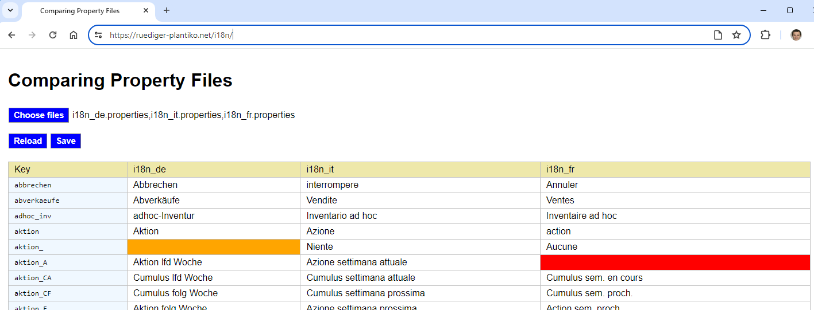

# property-editor
A tool to compare and edit multiple [`.properties`](https://en.wikipedia.org/wiki/.properties) files at once, particularly useful when they are used in internationalization as text ressources.
## Usage
* Call the web application by opening the link to the main `index.html` page in your browser.
* Choose one or more `.properties` files using the button `Choose files`.
* The file will be parsed, and the results are displayed in a table with a column for the keys, and a further column for each `.properties` file.
* Missing entries, or multiple entries for the same key, are marked with red color (CSS classes `.missing` and `.multiple`).
* Entries with only whitespace as value are marked with orange color (CSS class `.empty`) .
* All cells are editable. Also, when hovering over a cell, a cross-shaped icon ✖ appears at the right corner. This can be used to delete the corresponding key/value pair.
* When you have finished your work on the cell values, press `Save`.
* You will be asked to grant permission to save, and after doing so, your `.properties` files fill will be updated.
* With the button `Reload`, all non-saved input will be discarded, and the page will be rendered again with the contents of your files. 

## Screenshot
The following example shows a screenshot of the application, after having selected `.properties` files in three different languages. 

In this example, the property `aktion_` exists in German but has an empty value - whereas the property `aktion_A` is completely missing in the French language version of the file, i.e. the key `aktion_A` is not even present in this file. 

All the texts can directly be edited in the table. As soon as there are changes, they can be committed to the files with the button `Save`. 

 

## Installation
Since this is a purely client-side web application, there is no installation necessary. If you want to serve the web application from your server, just copy the complete folder `i18n` with all its contents to the appropriate location on the server. The web application can be called via the link to the `index.html` file.

## Usage as a node-webkit app
In former versions of this editor, the [File System API](https://developer.mozilla.org/en-US/docs/Web/API/File_System_API) was not yet available in a state that allowed to save files on the user's file system. Therefore, I had decided to provide the editor as a packaged [node webkit (nwjs)](https://nwjs.io/) app, providing the file save feature with the Node FileSystem API. All this is no longer necessary.

If you want to use the editor as an installable node webkit app anyway, create a folder `property-editor`, containing one single file `package.json`with the following content:
```
{  
  "name": "propcmp",  
  "main": "https://ruediger-plantiko.net/property-editor/?edit",
  "node-remote": "https://ruediger-plantiko.net",
  "window": {
    "width":1800,
    "height":1200
  }
}
```
With this package descriptor, the app is instructed to get all its ressources from the specified URL. 
Then start the app your favorite way, e.g. by dragging the folder containing your `.properties` file to the nwjs executable.
## Documentation
The usage of the app should be self-explanatory. However, I use it in a [blogpost](http://ruediger-plantiko.blogspot.ch/2017/05/anwendungen-mit-html-ui.html) to talk about some aspects of HTML UI development (written in German).  
